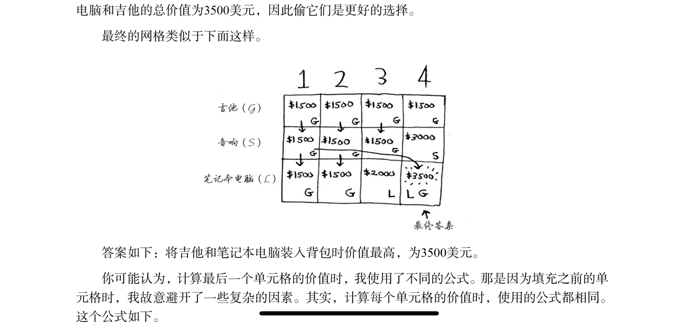
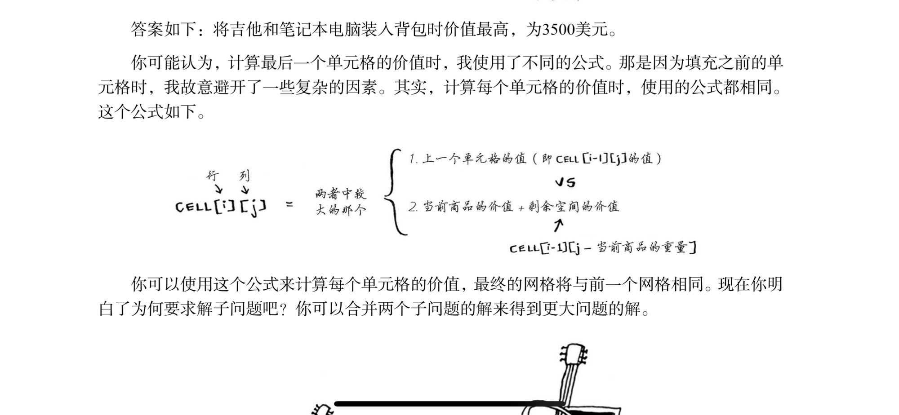

### 解释

在有限的资源下进行资源分配来达到最好的收益

通过分割子问题来解决这类问题中最大的难点-多种选择下，如何在有限资源中达到最大收益。

因为表格中每个都满足不超出大小限制、数量限制，所以在最后的选择中都可以选择，并且最下面的就是收益最大的选择，所以只需要再找一次这个表格就可以，有着只用计算一次的优点

### 局限性

对于不限量、数的情况，用贪心算法更适合

### 公式

### 优点

计算量减少：只需算出一次表格就行

代码量减少：每个表格公式都是一样的（解决子问题从而拼出最终问题的答案），所以只需要用一个方法就可以算出整个表格内容

### 缺点

理解难度较高：我现在就还没有掌握

实现难度高：虽然熟悉了就好，但对于初学者如何用代码实现这个表格是个问题

对简单问题没用：因为简单问题一眼就能看出来，特意去填表格反而话费更多时间