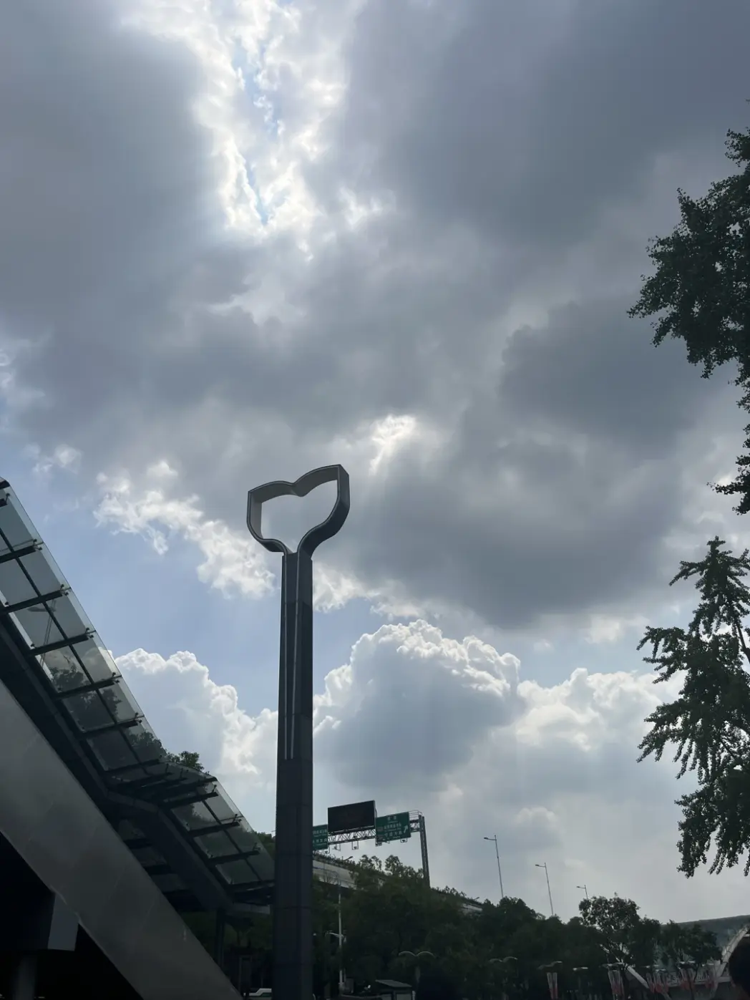
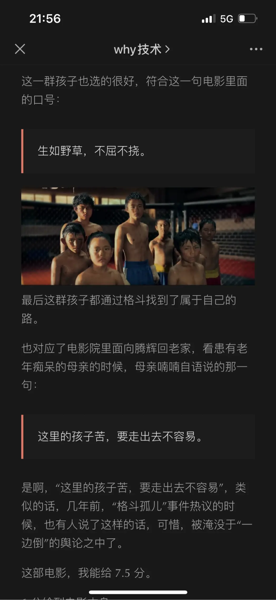
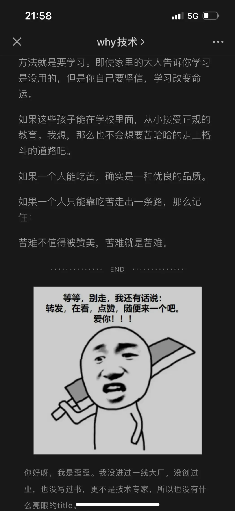

> 生如野草，生生不息

刚看完王宝强的《八角笼中》，视觉上的确好看，真人真事改编，的确好看，我觉得这部电影第一个吸引我的一个点是对当事人面对这个情况的选择。
世上没有天生高尚的人，也没有机会做好准备，只是事情来了，就摆在你眼前，看你怎么选而已。我如果被别人抢劫、还看到抢劫人家里的难处，我也会犹豫，我不知道我会怎么选择，因为这种事，一选就会影响一辈子，我虽然不是乡下村里的，但也是小时候从泥巴里滚大的，“生如野草，生生不息”算是我们这些小孩当时唯一的优势，哪怕到现在其实也是如此。
我越来越长大，但我的心态却还是有点娇生惯养，遇到一点挫折就喊放弃，受一点苦都受不了，和以前完全不一样。
希望我以后能经常想起这句话：“生如野草，生生不息”，不要轻言放弃

