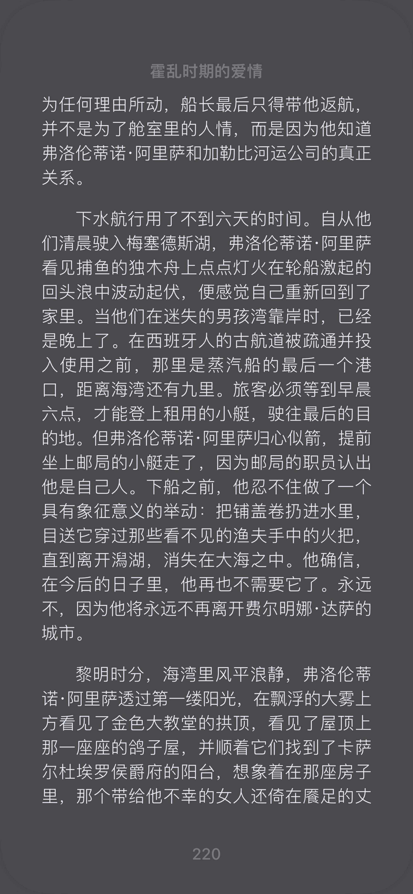

### 第一次进入主题
> “他做得对。”她反驳说，“如果他说了实话，那么无论是你还是那个女人，以及这里所有的人，都不会像曾经那样爱他了。”

我读到10%了，文章主要是以胡维纳尔·乌尔比诺医生为主线，从赫雷米亚·德圣阿莫尔这个儿童摄影师的死开始介绍了他的处境和他周边的人，除了他的老婆和儿童摄影师的女人，这好像并没有仔细说什么爱情，准确的来说像是在说各个婚姻的结果，而为了说出这些结果，于是介绍了人之前的背景。但是文字的确很精致，描写了很多细节。
——23.11.22
### 婚姻
在《霍乱时期的爱情》，有几点我不太懂，一个是乌尔比诺医生的妻子一直不懂其丈夫在想什么，这一点《傲慢与偏见》里也是一样，我一直以为我以后的婚姻应该是互相知道对方思考的，但现在我有点动摇了，在《傲慢与偏见》中，我是认为是因为其妻子的愚昧，和这本书是比较久以前的，所以没太在意，但这本书也是这样，而且其妻子并不愚昧，感觉不像是单纯的对与错那么简单，人的人生理想、处境的不同对人的思想影响很大，活得越久区别越大，所以他们的思想区别会越来越大，只是避免不了又不想争吵，所以只能互相体谅过日子，而且还有对方缺点放大这一加成。那么可能现在也有很多这样的婚姻，倒不如说到老了大概率都会是这种情况。我之前还说没讲爱情，但实际上大量的环境描写都是为了铺垫氛围，而当人物开始对话时，才会真正制造画面感。
——23.11.23
### 感性

我始终不能理解这种感性

这是爱情吗？好像的确满足爱情的特性之一：至死不渝。他在后面的确为了爱情终身不娶，放荡的生活也可以解释为因此导致的欲求不满进行发泄，不过他最终的行为终于能为他一直以来对她的情感得到证言。
——23.11.29

其实不管剧中人的结局是什么，给我呈现了多少种婚姻，我主要看的还是产生这些的本质，从而丰富我对事物的看法、让我对各种事情能够做出更加正确的判断
——23.12.07

### 迷路
> “至少现在，他见不到费尔明娜·达萨也能正常生活了，不像从前，常常要随时放下手中的事，凭着自己的猜想四处去寻找她的踪迹，漫无目的地徘徊在一些最不可能的街道，以及她无论如何也不会出现的虚幻之地，只要一刻见不到她，他内心的渴望便一刻不能停歇。”

我觉得这个人更像一个在爱情上迷路的人。他在早时的恋情中表现的十分炙烈，对未来的展望过于具体，而恋情的突然中断让他失重，迷失了生活的方向，以至于他一直没有从中走出来，如果不是医生的死，他会一直没有希望直至死亡。
——23.11.30

### 结尾
今天终于把书读完了，中午的时候就读到最后了，可惜读不完，到了晚上才有时间读完它，对于结局，我只能以我能接受的方式总结一句话：人是多情的，不像1+1就等于2，只不过在当时一定会有一个最喜欢的，而婚姻也就利用了这一点来用安稳来替代多情（其实这也是利用了人的另一个特性：胆小）。

但一段婚姻结束后的社会舆论与道德限制会使得多情这一天性不能有好的结果，而人到末年的想法又会使得人缺少年轻时的自制力，我认为这也是不幸的另一因素。

最后谢谢这本书让我明白了人的另一个重要天性：多情

不过我的结论在读完这本书之前一直在变，毕竟在书的开头就说了衰老恐惧症，而在末尾又对时光的流逝描绘的那么细致，以至于我一度以为本书的主题是爱情与时间，本书是想教会我时间对事物的侵蚀有多大。

其实我一直在以利益至上的角度来看本书，因为我觉得我工作的时候一直都能体会到利益纠纷。

不过本书到底想要讲什么对我来说其实并不那么重要了，我所要做的只是在这每天太阳都东起西落，我每天都上班出勤的日子里，磨练一副慧眼能够发现生活的美好就足够了。
——23.12.05
