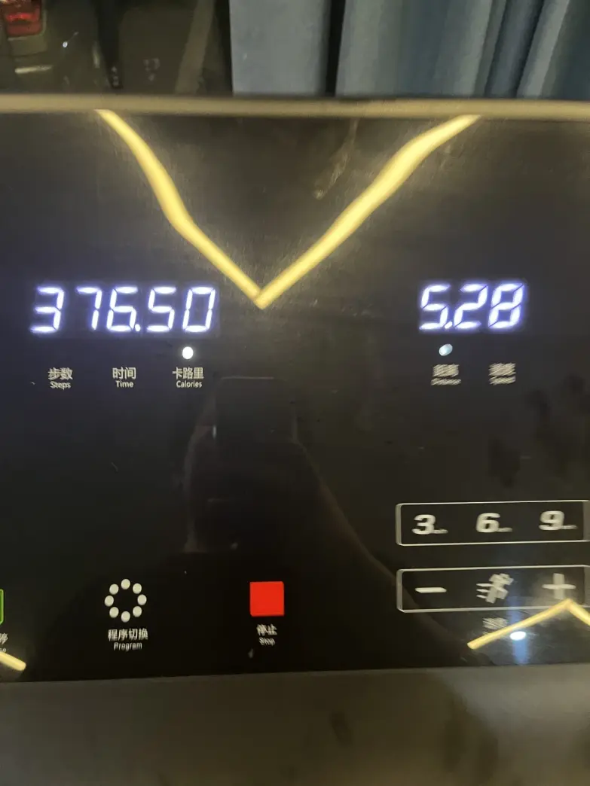

今天做了个梦很奇怪，是个生活在低重力的梦，在梦里可以通过手就能爬上高楼，不过哪怕在梦里离开地面也会有点怕，所以当探险时最高大概就爬了十多层的高度，还有一个事是在爬高楼的时候看到了同事在一个角落里叫我过去聊天，然后我们就在那个角落里聊了会天（这可能体现出我比较寂寞的心里？），另外一件值得说的事是还有人放烟花，而且是立体的，能放出文字来的那种，并且一个沙发一样的东西在升高，然后烟花就在它旁边升高，上面坐着一男一女，那烟花是很好看的，我在远处就往那里追了很久。
唯一的星期天，做了这个梦感觉很有意思，低重力感觉很好玩
