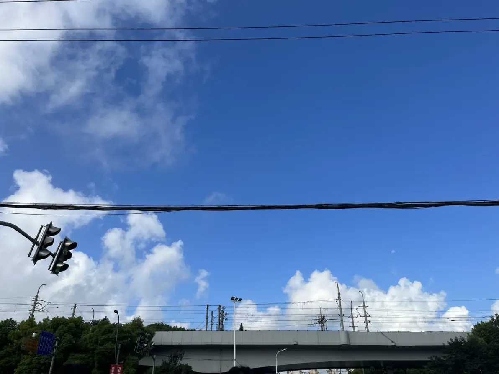

### 我还做不到的事
1. 逻辑：我只要稍微碰到一点复杂的逻辑，就会感到烦躁、认为解决不了，因为我平时就没有做高逻辑事情的准备，所以遇到的时候会给我带来很强的挫败感，可以看出平常的技术学习与leedcode刷题还是必要的。如果能做到，至少再出现高逻辑的事，自己也不会急躁了。
2. 经验：我平时所做的需求实现设计都是根据需求当时来实现的，所以难免会设计不全，就算设计完了也会感到心有不安。平常就应该多加理解其他架构设计与更好的工具，加强眼界。如果能做到的话，平常做实现就能心安一点了。

感觉在这家公司呆久了，自己疏于平常的能力锻炼，公司也没有什么学习环境，我的能力可以说是下降了，再这样下去很有可能出现被辞退然后找不到工作的情况，不管公司怎么说，我自己还是要注意平常的积累，因为只有这个是属于我自己的。
我只是一个软件工程师，只管实现，所以经验累积、一直保持好的学习态度，才是我本职的核心价值
