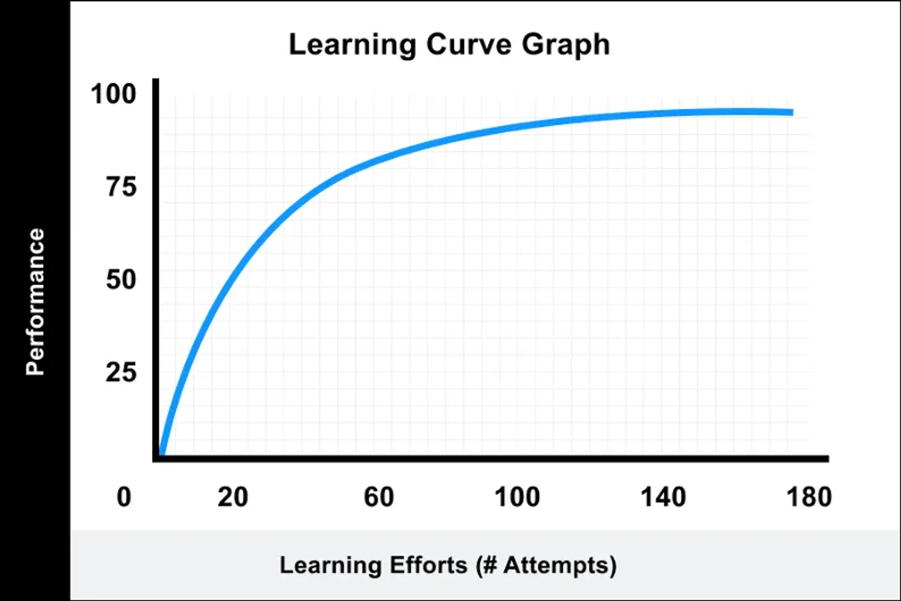
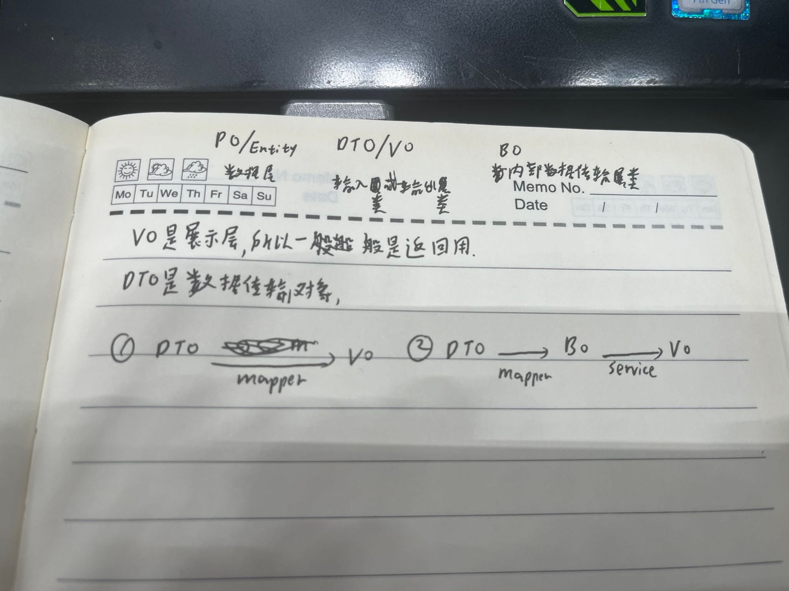
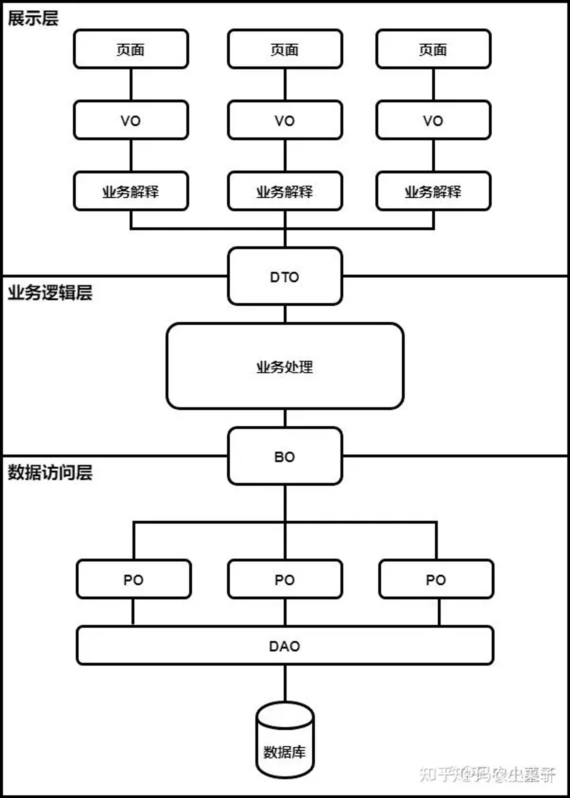

今天来图书馆明显比昨天兴致要低一点，不过，学习本来就是一件持续地事情，不可能每次都能兴致高涨

父母呼，应勿缓；父母命，行勿懒；父母教，须敬听；父母责，须顺承；

今天地目标主要有几个，一个是继续看这本《弟子规在说什么》，这本书里关于培养合作和学习的素质是我以前忽略的，令我感兴趣，
不过哪怕我懂了道理，但我还是没有动力去实现，所以我要先找找让我自己变得更好的动力是什么？

我首先想到了金钱，毕竟我工资并不高，有点存款，最近又放到了定期里，能花的就只有1万左右了，所以需要努力；
其次是之前下定的决心：比起眼前的诱惑，提升自己更加重要；
还有就是在工作中遇到的局限性；
但不知为什么，我还是在犹豫下不了决心，学习的确很容易上瘾，但我总是难以在学习和娱乐中找到平衡，是因为我现在没有在意的东西吗？

其实是有的，之前过年出去做客，我和我妈一下午无聊就去旁边的村子里走了走，那的确很有意思，
有像是很久没有人走过的小路，路上全是积满灰尘堆积在一起覆盖道路的大片落叶；
还有风吹过树叶沙沙作响后回归平静的安宁；
有合适的太阳、微风照射和吹拂在我的身上；
路旁边的房子也没有人，就只有我们走在路上；
偶尔会遇到小孩在路边玩耍，小鸟或别的小动物在旁边出没，
哪怕是现在我偶尔回忆起那时的宁静也会感到幸福。

***
今天其实还看了一篇文章，感觉写的很中肯：
[入行十五年，我还是觉得编程很难](http://mp.weixin.qq.com/s?__biz=MzI2NDU4OTExOQ==&mid=2247669069&idx=1&sn=366294e6c282c07607d04b08ca13cc04&chksm=eaa64f1dddd1c60b91030256010294902d9de14695b282bcdc6f98fa8df8806aa0dd0ddb4a50&mpshare=1&scene=24&srcid=0406RoYWc8sDjosTxSFbHkvZ&sharer_shareinfo=b4e902de471e722a4421cca69d066575&sharer_shareinfo_first=b4e902de471e722a4421cca69d066575#rd)

看完了，我还是觉得：我能给公司做的，就只是保证代码稳定而已，不能解决存亡问题

# 1. 写代码很简单，但写好代码很难
## 1.3 写好代码的捷径就是不断地阅读、编程

> 如果你去查阅相关资料，你会发现许多职业作家的日常生活，就是阅读和写作两件事在不断循环。他们每天会花大量时间阅读各类文字，然后再写作。

> 同样是“文字工作者”，程序员们就很少重视阅读。但要想快速提升编程能力，阅读正是不可或缺的重要一环。除了日常工作接触到的项目以外，我们应该更多地阅读那些经典软件项目，从中学习 API 设计、模块架构和代码编写的技巧。

Programmers Don't Read Books -- But You Should（都说程序员不读书——但你应该读）

# **2. 编程的精髓是“创造”**

虽然“创造”好处多多，程序员们也有大把机会去做，但许多人常常缺少一种身为“创造者”的觉悟。就像那个广为流传的小故事所说：一位哲学家询问正在砌砖的工人，有人清楚地知道自己是在建造一座大教堂，有人却认为自己只是在砌砖。很多程序员正是“只见砖块，不见教堂”。

# **3. 打造高效试错的环境至关重要**

**理想的编程体验≈“刷题”**

要通过改善环境来提升编程体验，可用的理念和工具包括：

- 模块化思想：妥善设计项目中的每一个模块，降低耦合，提升正交性
- 设计原则：微观层面上，应用那些经典的设计原则和模式，比如“SOLID”原则
- 自动化测试：编写规范的单元测试，必要时使用 Mock 技术，用自动化测试覆盖业务关键路径
- 缩短反馈回路：切换编译速度更快的工具，优化单测性能，竭尽全力缩短从“改完代码”到“获得反馈”的等待时间
- 微服务架构：必要时，将大单体拆分为多个职责各异的微服务，分散复杂度
- ….

关注编程环境，刻意创造出允许高效试错的“代码乐园”，让工作像刷题一样轻松愉快。是经验丰富的程序员能为自身团队做出的最好贡献之一。

# 4. 完美主义代码

世间没有完美的代码。大多数时候，你的代码只要能满足当前需求，又为未来扩展留了一些空间就够了。

# **5. 技术很重要，但“人”也许更重要**

单一职责原则  “每个软件模块应该只有一个被修改的理由”。

编程脱离了人，也会走不下去

能做到，并不意味着你该去做

这句话无论是代码，还是人也是如此

# 6. 求知若渴是好事，但也要注意方法
## **6.1关注学习性价比**

下面这张图，展示了学习成效和投入之间的关系。

# **7. 越早开始写单元测试越好**

写单测的好处很多，比如单测可以驱动你改善代码的设计、可以作为代码的一种文档，等等。此外，完善的单元测试还是构建前面提到的“高效犯错的环境”的关键。

《有关单元测试的 5 个建议》

# 8. 程序员最大的敌人是什么？
## **8.1 复杂度是最大的敌人**

- 来看看那些导致项目复杂度不断增长的要素：
- 不断增加的新功能：更多的功能等于更多的代码，更多的代码通常意味着更高的复杂度
- 对高可用的需求：为了实现高可用，消息队列等额外的技术组件和代码被引入
- 对高性能的需求：为了提升性能，缓存和相关模块代码被引入，部分模块被拆分后，换成高性能语言重写
- 一再被推迟的重构：因项目排期过于紧张，迫在眉睫的重构被一再推迟，技术债越积越多
- 忽视自动化测试：没人写单元测试，也没人关心测试
- …

***

# 实践
- 单元测试
- 阅读代码
- 
  昨天有看策略模式、lambda表达式，函数式编程，今天继续去积累这个demo项目，可以继续去看函数式编程、设计模式、api设计
## api设计
api设计，一般接到新的开发需求都是根据现有模块做新增模块，比如融资项目当时提出一个提额需求，那么就需要一个提额流程能让客户走下去，最后的目的就是增加授信表的可用额度。

这种情况我们肯定式要建新表的，比如提额前需要走认证流程，

做api接口，首先我们要完成它的功能，然后，需要清楚理解这个接口在这个项目接口管理中的位置在哪里？最后，我们需要看怎么去设计这个接口能够满足开闭原则

接口千奇百怪，有某一个模块基础的增删改查接口；也有需要整合多个表数据并进行处理再返回的接口；

有需要返回某个模块某条记录的所有数据的接口，也有只需要返回一个字段的接口或需要返回多个表的整合数据；

如何管理接口才能做到一目了然减少学习复杂度呢？

接口应该按模块分而不是表去分，就比如说一个产品模块可能会用到多个表，有的时候只用主表数据，有的时候需要用到多个表

其实想要做好管理，用一个接口文档就能解决

比如查询接口，

- 有后台需要查询所有用户列表的分页接口（selectList）
- 也有提供给前端调用，根据token获取当前用户信息的接口（getLoginInfo）
- 也有需要提供给其他服务获取用户信息的Feign接口（getInfo）
- 也有需要返回用户的权限、认证情况的信息接口

单一职责原则，理想情况是每个接口都只负责一个业务逻辑

一般来说，接口的颗粒度越小，被复用的可能性就越大

新增接口并不难，难的是多个接口的逻辑，怎么能都遵守一套修改表、查询表的逻辑？如何能保证修改一个接口，另外的接口不会受影响。或者说哪些接口会受影响？

api都是根据模块划分的，其中重复的处理逻辑，怎么归类到一起

我看ruoyi-cloud-plus的用户service层

- 返回值分页和不分页分开（只有一个职责，的确满足开闭原则）

再说回我的产品接口

我有查询产品表的接口、查询产品-产品附属表的接口

建议：

- 接口名最好起的更加简单易懂、更加具体、灵活使用接口前缀来精简接口
- 设计接口的时候，最好是把接口功能完成，然后确保一定的扩展性，比如我需要查询当前用户已上架的产品，从横向扩展的角度讲，比起把它放在产品列表接口里，更好的做法是把它划分为颗粒度更小的接口更利于扩展，所以这个接口的定义就是根据状态不同返回产品列表，以后有其他类似需求就可以扩展这个接口进行复用
- 一定要把逻辑放进service层，只有这样，才有可能做到小颗粒度逻辑复用

为什么要使用bo、vo呢？

根据单一职责原则，实体类的作用就是与表一一映射、专门负责与数据库相关的交互；bo就是单个表的入参；vo就是单个表的出参，它们都只有一个职责。就接口而言，无非就是增删改查，其中所有接口都要bo，新增/修改的bo和查询的bo有点不一样，首先可以把常用的分页入参等字段放进一个bo里作为公共复用bo，然后修改用和查询用我建议分开，还有feign、传值用的也应该分开，和页面用bo分离

像我的产品查询相关接口，可以分为

产品管理：列表分页查询接口、单个产品查询详情接口

h5端首页：查询已上架的产品列表接口（产品名称、产品id），

优客推荐页面：查询已上架的产品列表信息

根据单一职责，通过表-业务逻辑来进行划分，就是产品表-状态筛选列表接口，这样就能不给列表接口增加复杂度，把状态筛选划分出来了

列表接口除去通过筛选条件划分更小颗粒度，也可以通过返回不同数据划分更小颗粒度接口，不过要注意一定的扩展性，比如info、attachInfo这种命名

