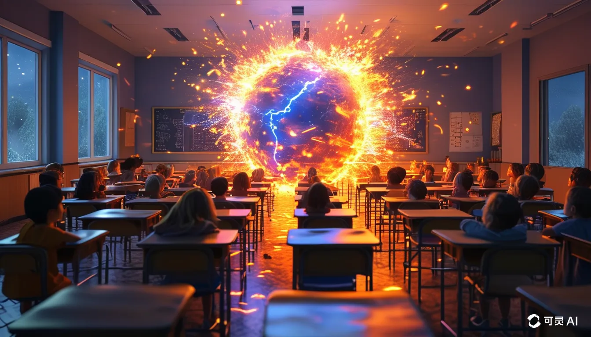

# 文生图

刚体验了下快手的可灵，感觉还是人工智障，比如我想要一个女孩转笑为哭都做不到

[kling.kuaishou.com](https://kling.kuaishou.com/)

感觉如果想要精确，还是需要**Stable Diffusion，**

> 老师，教室，火焰术，火球，充满教室，学生，惊讶，火焰光芒，热浪，现代教室，黑板，地图，超级真实，16K
> 

二次元漫画风格，四宫格，黑白，勇者，施展魔法，恶龙，宝剑，严肃的场景，黑夜

二次元漫画风格，五官清晰，超细节，神秘女巫在森林中施展魔法

动漫3D风格，宫崎骏风格，温馨的环境，丰富的场景

二次元漫画风格，黑白，老法师释放水球，飞龙

# 杂

今天进入状态的时间比较晚，这也让我突然意识到了一件事，那就是我其实有很多都不会，我虽然会怎么编写java程序，但我不知道出去玩的方法，虽然会来图书馆进行学习，但自学的进度远远赶不上那些能每天系统学习的人，虽然能体验很多ai应用，能看到很多ai相关的项目，但只能在外围看，很难参与到其中去，一句话总结就是，我发现我会做的太少了，我之前一直埋头学ai，过了一段时间，觉得自己好像懂了一点，就像入了行一样，但今天当我停下来抬头看的时候，我才发现有我没我都一样，可能在专业学这个的人眼里，我就是个异类