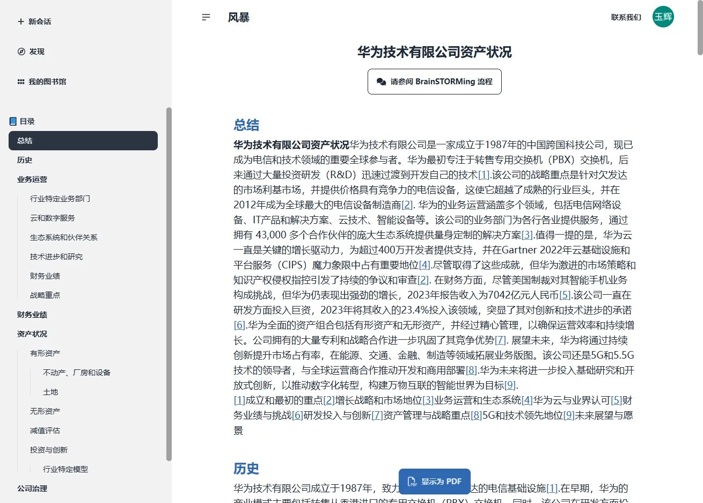
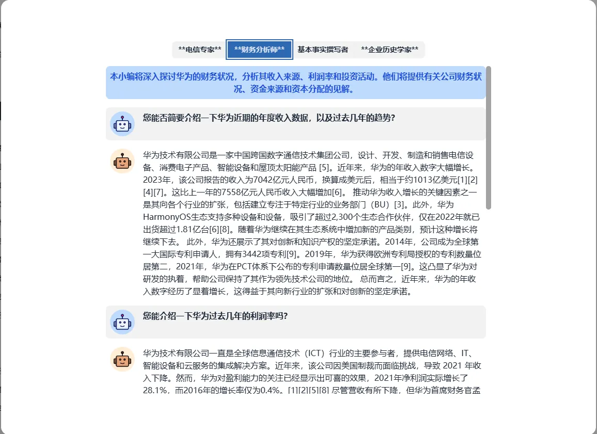
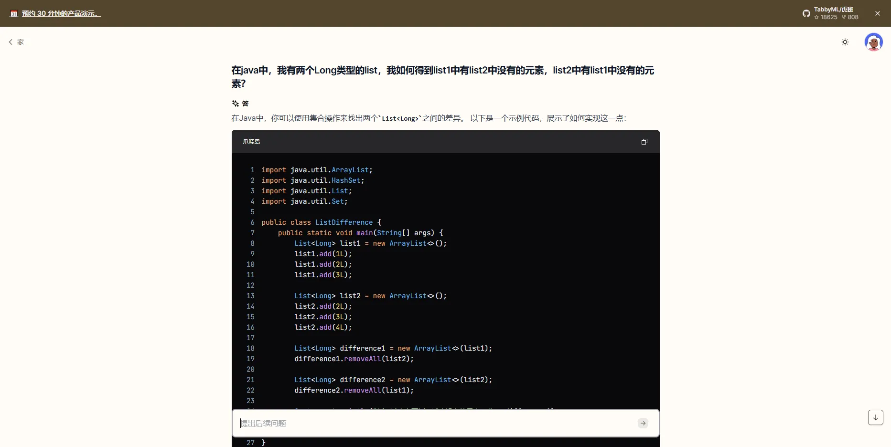

我今天想要把在工作之外的重点给找回来，还有把自己的效率给提回来

- 本周思考
- 技术研究（偏体验、ai）

# 杂

### chatGPT微调

[www.zhihu.com](https://www.zhihu.com/question/591066880/answer/3548243003)

微调方式：[Fine-tune微调](https://www.zhihu.com/search?q=Fine-tune%E5%BE%AE%E8%B0%83&search_source=Entity&hybrid_search_source=Entity&hybrid_search_extra=%7B%22sourceType%22%3A%22answer%22%2C%22sourceId%22%3A3548243003%7D)和Prompt engineering特征工程

提示词其实就是在输入里加一些辅助的提示来保证回答的精准度，主要看训练方式的微调

他这个微调好像不贵，以后如果在私用领域的话我说不定可以尝试一下。

## 决心

我已经快要忘记我是怎么成长到现在这个26岁现状的了，回想起以前的日子，我应该有提高自己的执念

## 对后期的规划

经过大学毕业即失业的经历，我已经十分痛恨没有未来规划的日子了，我最近也在公司做了快3年了，我觉得我现在好像有点缺少对未来的规划了，之前一直在看银河帝国和ai，注意力被分散了所以衰弱了这一块，现在打算拾起来，而想要完善简历、增减面试能力，除了背八股文，最好的是平常把技术积累记录下来来提高自己的技术直觉

这周在尝试写一个数据权限的注解来实现本部门及部门以下的数据隔离，这中间我看到了很多ruoyi

有意思的设计，以下我来说一说这几个点

- `List<SysUser> users = SpringUtils.*getAopProxy*(this).selectUserList(user);` 这行代码的效果是调用同个类的方法时，使得aop注解生效
- **本部门及部门以下查询、增删改的数据过滤**：对于部门及部门以下，我是把查询和增删改给分开了，因为查询校验如果有一个数据不通过不需能直接拦而是过滤所以用sql就行，但是如果是操作接口因为用就需要用方法，因为需要输入被操作的数据的部门id，所以不能改成注解形式
- **数据权限注解的性能问题**：我一开始是采用在sql最后面拼接子查询的方式实现，但后面发现，如果要做用户表的隔离（子查询除了组织表，再加一个用户表）则会很慢，不过后面突然看到了ruoyi的做法，ruoyi是在token里面存了本部门及部门以下的部门`children`的，而如果是需要用到用户表的情况，则直接在原sql里左查询一个用户表，所以根本不用子查询，我现在也是借鉴了这种做法
- 我这次有个需求是需要返回使用数量，能做的方法有两个，一个是把原本的sql全部都重写一遍，只查询数量，第二个是用一种方法改动原方法，让sql只查询数量，不进行后面真实的数量查询，我个人倾向于第二种，不过那有个前提是必须要准确设置在要查询主表的前面

其实这些都是对需求进行分析，然后选择了通用的做法来实现，因为我觉得这样会比较好，就像我之前做的缩链、中间页等，现在ruoyi的版本是3.6.4，之后想去看一下ruoyi还有哪些好的设计，我看了下，发现不使用起来的话好像没有动力去看它的代码，也就不能体现它的设计好处

## 整理日记（未完成）

# trending

### storm

https://github.com/stanford-oval/storm

storm可以通过一个主题从而生成一篇文章，原理是会根据主题去网上找信息，然后自己总结出一篇文章，感觉通用性很大，如果准确的话说不定会有很大的作用，而且现在可以免费白嫖

但是我本来想生成一家公司的贷款意向结果失败了，好像要更详细一点，也有可能是我问的不对

下面生成的这个，先不管说的对不对，但好像说的像真的样的

这个要openai api，所以本地部署不了

华为公司资产情况

### tabby

https://github.com/TabbyML/tabby

GitHub Copilot 的开源替代方案，可惜还是需要open api，有在线的聊天功能，看回复感觉和chatGPT一样，不过它的功能应该主要是集成在ide里的

### PaddleOCR

https://github.com/PaddlePaddle/PaddleOCR

这里有个ocr，试的在线感觉还行

