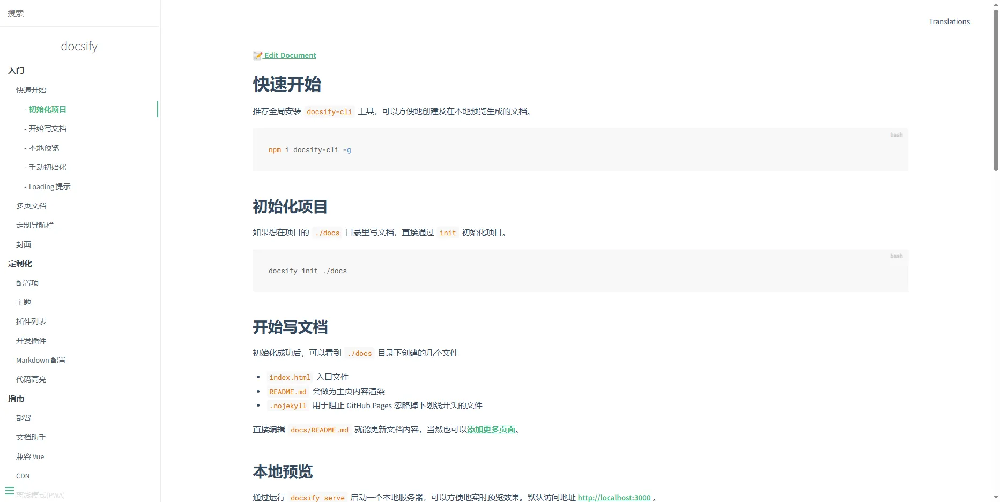
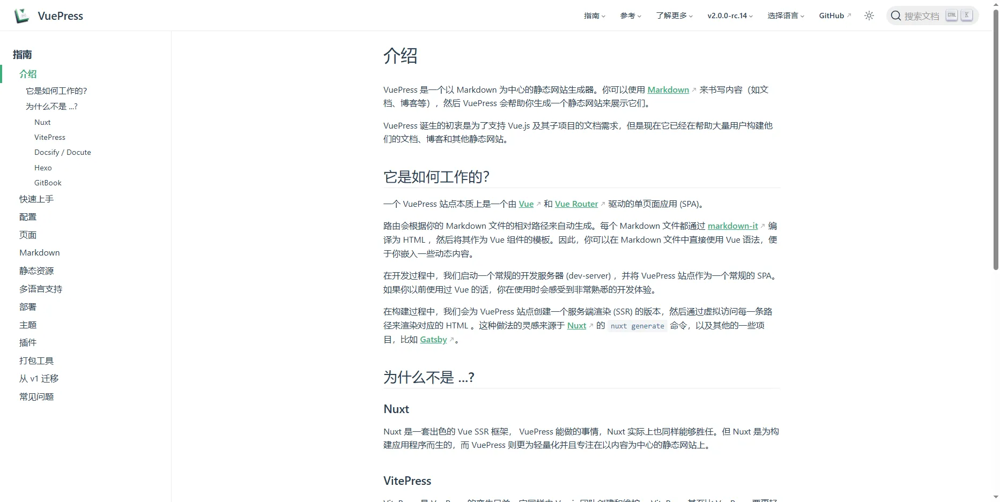
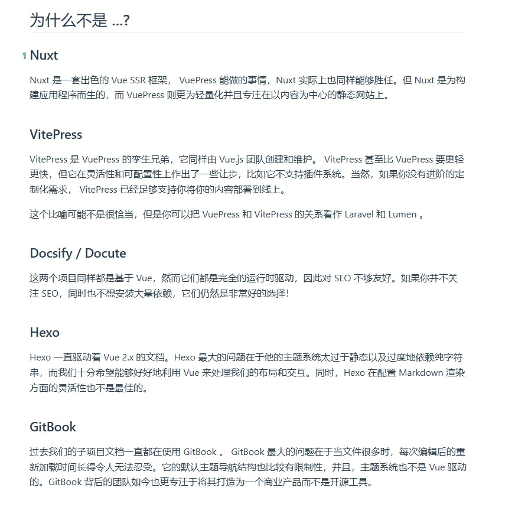

我是不是应该写一个文档，来记录我对某些平常用不到的抽象思考，比如

对公司的思考：数据分析，对于业务不是必要的，普通员工也不会想到这一点，但却是每个公司都需要的

ai在游戏中的实现：我们知道ai只能对已有的东西进行数据分析，只能进行组装而并不能创建新事物，它的强项在于数据分析。在泰拉瑞亚，怎么去用提示词去做自己想做的事，比如创建一个“新”武器、把地图颠倒、改变地形等，ai洗刷传统互联网肯定是会把以前的不完美给去掉的，但是也需要注意ai的处理过程是黑盒的，所以可以参考腾讯音乐的那个用自然语言生成sql的项目

一个人在家就打开音乐外放

# 杂

- 继续学习英语
- 尝试用一个文档来记下我对各个领域零碎的思考
- 了解ai

# docsify自动生成文档

https://docsify.js.org/#/zh-cn/

虽然`vuepress` 好像比`docsify` 要好看一点，但是`vuepress` 感觉要更麻烦，所以先尝试下`docsify` 

# 【TED】工作中繁多的条条框框会限制你的效率

这个视频讲了很多的点，最主要也比较讽刺的是，人们为了追求更高的效率，想出了责任制：谁需要为这个过程负责？这样大家分工明确，所以事半功倍，但是谁都不关心这件事最后是否能成功，因为已经有责任制了，那按道理每个人做好自己的最后就不会有问题，但实际上，在工作效率上，除了责任制有很好的成效，还有合作，每个人的能力都不高，但是通过合作就能累加起来使个人发挥出超于个人的能力，这对工作效率的提升也很高，但是责任制消减了这一点。

责任制是让每个人专注于自己负责的地方，分工明确，所以事半功倍

**合作是指自己做不到的地方交给他人，他人做不到的地方自己可以承担，这样搭出亲密无间的合作关系就能使个人发挥出个人以上的能力**，视频中举出很明显的例子就是接力赛跑

按理来说，在接力赛跑中，一个团队的每个成员能力都优于其他团队，那这个团队就应该取得冠军，因为她们每个人都能比别的团队跑的快一点，累加在一起按理来说应该就能优于其他团队，但实际上如果没有搭建好的合作关系，就算没有矛盾，那每个人也只是做了自己能做的，它能保证对于最终获胜有一定的助力，但这个助力的上线是定死且不灵活的，我自己举个例子

假设我要写一篇文章，但是这个文章太大了，所以我需要多个人来写，开个会来确认下哪个人来写哪部分，然后大家各写各的。但是大家写完整合看就会发现文章整体并不通顺，这次的文章差强人意。

第二次，我再写一篇文章，这次我同样开个会讨论谁写哪部分，然后大家各写各的，写到中间，我再开一次会，讨论大家的进度顺便尝试把大家的文章整合起来，读一下看通不通顺，发现不通顺，这里就会出现第一个矛盾点，这中间地方的不通顺谁来解决？按照责任制的角度，好像谁都没有道理为此负责，准确的说是对个人没有好处。

这不仅仅是指这个文章问题，我在现实上遇到的是，上面要做一个东西，拉我们几个小伙伴开了一次会，除去指定每个人需要完成的模块，其中两个模块只有一个人比较熟悉，所以虽然我分到了一个模块，但是我需要时常去问另一个人，来提高效率和防止掉入坑中。在我频繁的去问她的时候，她也会逐渐感到不耐烦，然后进行思考，她为什么要帮助我？她有自己的事要做，

在这件事上，她的能力高，我的能力弱，如果只是责任制度，问题肯定会出现在我这里，所以才需要合作

在现在的公司，我去主动帮助别人都是个人原因，比如晚上发版，因为某个人发上去有问题卡住了测试流程，所以需要大家一起等，那么我就会主动去看看问题，来让自己好早点下班。如果问题出现在那个人的能力外，我也不会怪他，而是专注于解决问题。一是怪别人并不能让我早下班，

以前，对于分配给我不是我工作范围内的简单的事，我在不忙的时候都不会推而是配合去解决它，因为一是我有时也可能需要找到别人，二是我不想影响彼此的关系

- 责任制度，在各自负责的中间，谁该为此买单？
    - 虽然主动合作对我个人并没有好处，事情失败了只要不是我的责任范围内也不能怪我，但是
        1. 我不接受不合理的地方：我不能接受不合理的失败，能力不足导致的失败就算了，能解决但却因为方法错误而导致的失败是我不能忍受的

需要明白的一点是，制度是为了让我们更有效率的达成目标而产生的一种方法，但如果因此使我们远离了最终目标，我们就应该灵活变通暂时放弃它

上课记笔记也是一样的道理

# 模型训练费用

https://github.com/wdndev/llama3-from-scratch-zh

刚看到了一个训练模型的训练时长

> 8*A100， 42B token，1 epoch，92M，15小时左右
> 

腾讯云的A100每小时是28元，也就是说哪怕是基础训练费用，都要28*8*15=3360元了，简直就是烧钱果然还是玩不起，而且这还只是一个效果没有那么高的模型

我想找一个带有dongnian的类似til的引导人去做某件事的项目

learn-java-llm

我使用docsify创建文档，发现文档并没有自动生成目录