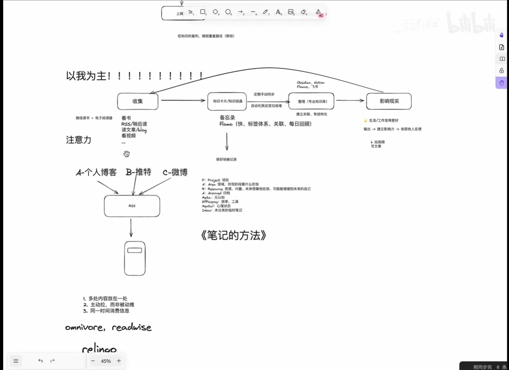
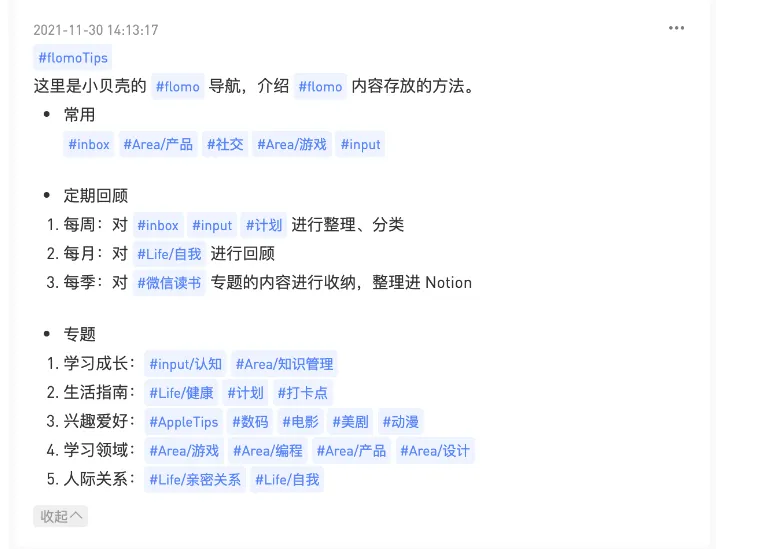
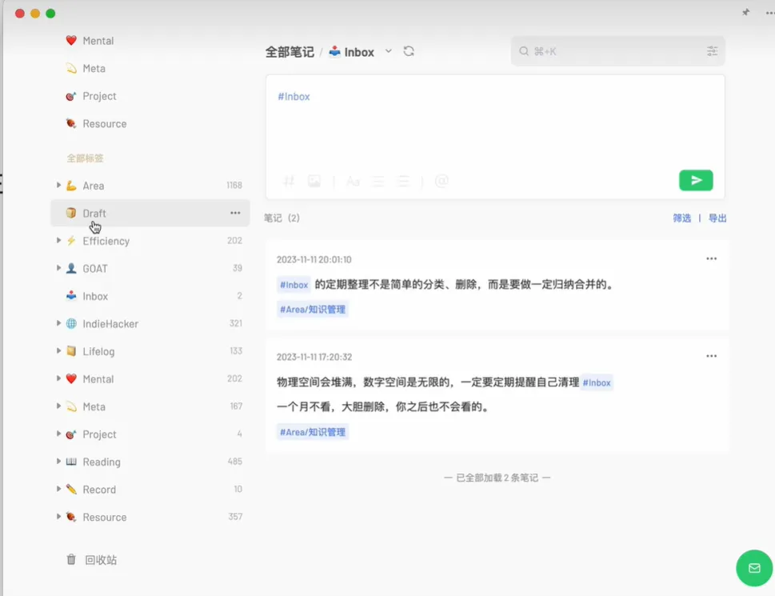

- [x]  记录本周的持续改变
- [ ]  学习英语、复习英标
- [ ]  学习ai
- [ ]  找软件架构资料增加分析能力
- [ ]  思考自我现状
- [ ]  看稍后再看的视频

> 找软件架构资料增加分析能力
> 
> 我尝试去看软件设计的书，但是感觉看不下去，我觉得我应该更适合在讨论中学习这一块

# 收获

- 在平常生活中，养成使用flomo记录碎片思考的习惯，并积极使用主题进行分类
    - 把notion里的思考放到flomo里，来磨练出一个自己的标签分类
- 提高从书中获取知识的效率
- 减少被动推送信息的情况，不要丧失集中注意力的能力

# 杂

## 学习视频

这个视频我主要的收获点是，笔记的分类方式、

这个学习视频讲的还是挺有意思的，除了有点小广告，整体思路还是挺好的，这里我主要关心的有几个点

信息收集：

- 只关注自己能力的实际增长，不关注过程的区分
- 保持注意力：主动拉而非被动推

知识卡片这个我比较喜欢，之后尝试一下

信息整理

- 以主题整理笔记

如果做好了这些的话，本质上就是不断的循环这个积累知识的过程了，但是我有几个疑问

虽然笔记分类、主动拉而非被动推这些方法都挺好的，但是知识收集这一块我不太行。

视频的知识收集我可以用它的方式，先放到稍后阅读里，但是对于书的收集方式我不太擅长，

我的文字信息主要靠书、微信公众号、知乎，可能看的比较多的是知乎，我都是就那样刷下去的，

我主要想说的是，看书都是靠自己，但我做不到高效的看书，可能是因为比起书，我看文章的接受率会更大一点

我觉得我能在周末看到这个视频就很有同感，这个视频讲的是知识的收集与整理，而这也就是我周末以及平时想做的

## 知识分类

这个就像代码中的按理分类一样，写笔记并对其进行分类可以平常在生活中对

## 收集知识的效率

我其实看看一本书是很慢的，而且老是只记得当时，之后就忘了，但其实这样会妨碍我们获取知识的效率，会使得渐渐慢下来

我会养成这样的习惯是因为我看东西很少去看第二遍，所以我害怕把书太快看完，但其实这种害怕是盲目的

https://excalidraw.com/#room=693868d3e6b087994ac1,eDnjz5O5XkbUjbTnWQ8jDg

不要盲目去反感提高效率的建议，因为对于工具书来说，效率

# 程序设计

> 我现在的场景不是性能，而是设计的更加合理
> 

## 不要优化

**Effective java**提到不要去优化代码，它有分几个点去说，

- 优化代码可能会导致你的代码结构受到限制，而那正是不可逆的损失

## 命名规范

我觉得至少还是名词、动词要区分开