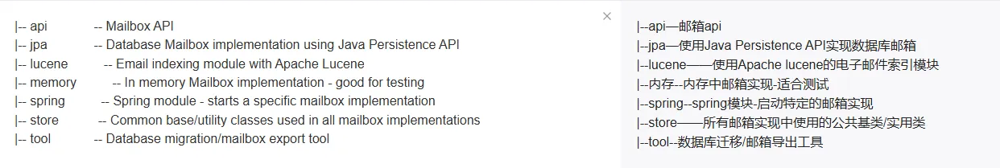
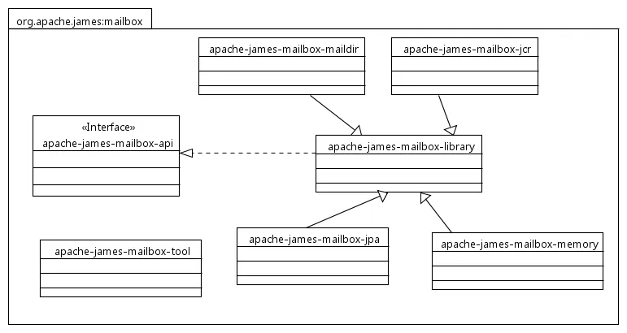

- [ ]  技术
- [ ]  英语
- [ ]  知识收集、知识卡片的实践
- [ ]  看书

- 个人的思考

如何才能做到在家里不后悔的放松方式

做手工

电纸书

重要的还是当下的自己，我使用工具记录思考的目的只是为了让我的思考能在长远的时间里走向我想走的方向

**如何能在放松中快速集中精神？**

**半年总结视频**

我觉得它主要讲的几个点比较引起我思考：设立目标、婚后生活、回忆、放慢脚步

**为什么要看开源项目？**

这里面我觉得比较好的一点是说了spring中实现一个流程的优雅实现值得我们去学习，因为你以后也有可能在工作上会需要从零完成一个东西，而这个东西可能以前人家就实现过并且很完美了，你完全可以去借鉴一下

其中除去提到了spring，还提到了apache mailbox

# **apache james mailbox**

https://github.com/apache/james-project

就如同上面说的，你以后很有可能会需要从头实现一个东西，所以可以去借鉴别人的实现方式来使得之后可以借鉴

这个项目拉下来的是james-project，不过不要紧，我们主要还是看mailbox模块，这个模块主要有几个小模块

- api模块
- jpa模块
- 索引模块
- 内存模块
- spring模块
- 公用实体类模块
- 工具模块

先大致看看适不适合

## 本地部署与使用

https://blog.inkroom.cn/2022/11/14/2VRR7FK.html

参考这个文章来学习james，目前是拉了代码，下了很久的依赖，还没编译成功过

### 之后-todo

编译完成本地启动配合win的客户端用一用，然后开始使用deBUG和jmapp来看源码

参考：

https://blog.inkroom.cn/2022/11/12/3588MKS.html