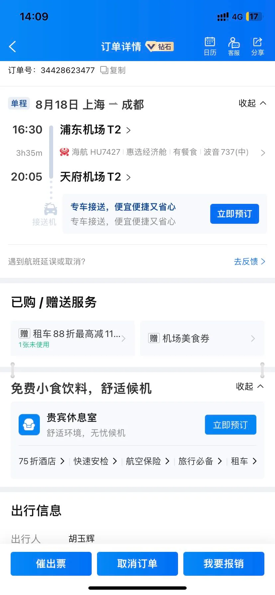
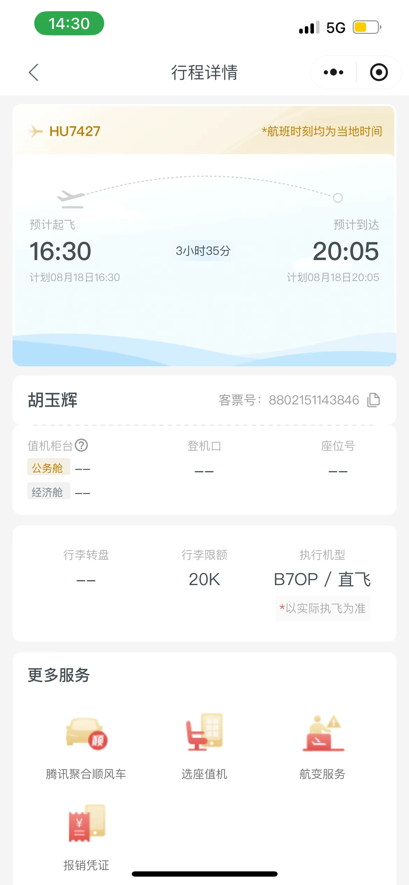
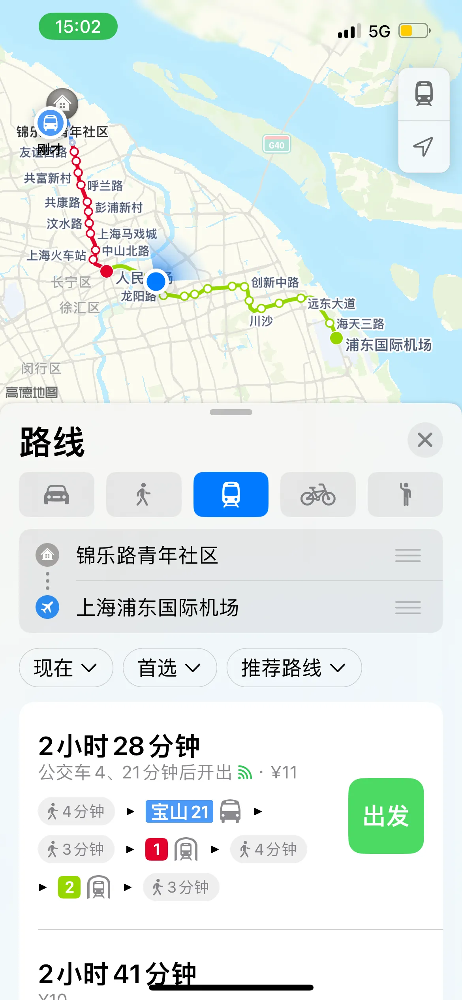
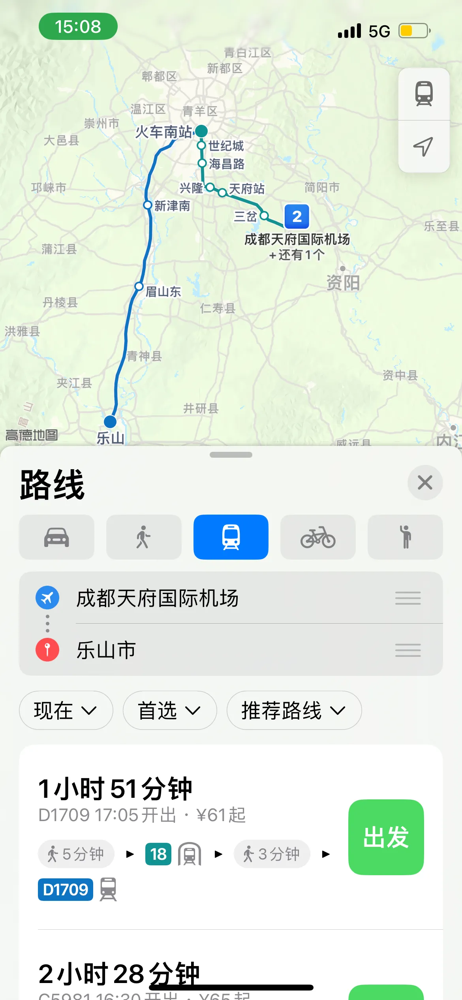

今天早睡明天早点起12点前吃完饭吧，

需要确认是否需要行李托运，飞机上还不能听歌

# 出差

## 到机场要解决的问题

- [ ]  登机口位置
- [ ]  行李是否真的需要托运？怎么托运？
- [ ]  确认火车和酒店

## 准备行李（0）

身份证

换鞋子

袜子

牙刷毛巾

电脑

眼罩

手机充电器

剃须刀

墨水屏充电器

笔记本和笔

衣服

5-6件短袖、内裤

## 应该需要托运

我的行李箱24寸，需要托运我的行李箱24寸，需要托运

## 行程安排

明天下午【16：30】的飞机，最好提前两小时到就是【14：30】，坐地铁2个半小时就是【12：30】出发，然后【20：05】到成都天府机场，下飞机还要去乐山至少花两小时，最终最早【22：00】到酒店

## 定酒店

还需要拜托项博酒店的事

# 杂

- [ ]  预计一下明天坐飞机的准备
- [ ]  过一遍工作文档
- [ ]  探讨是否买相机
- [ ]